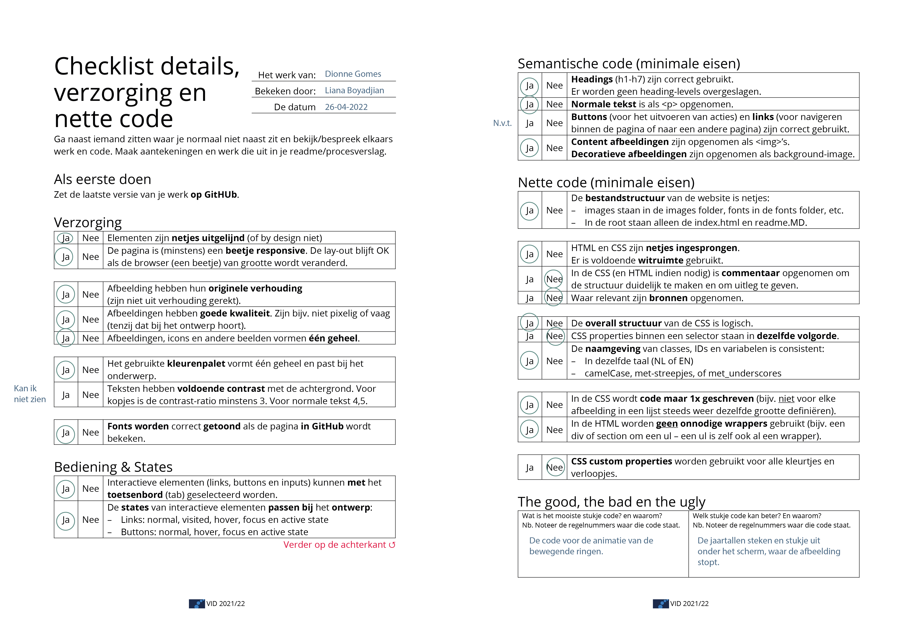
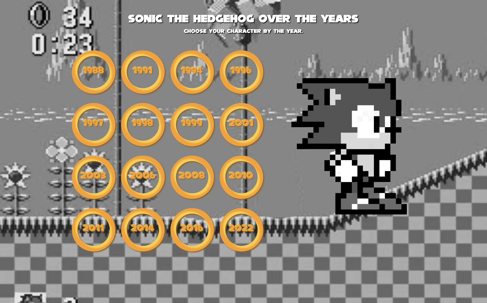
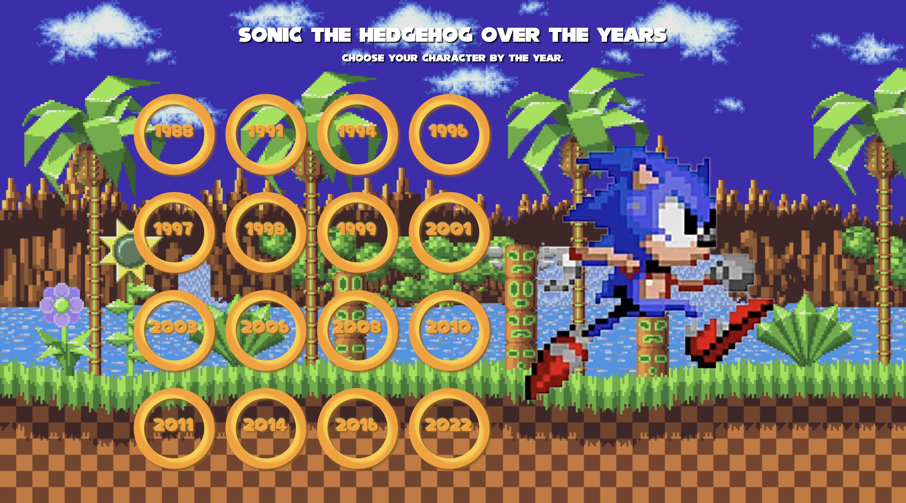
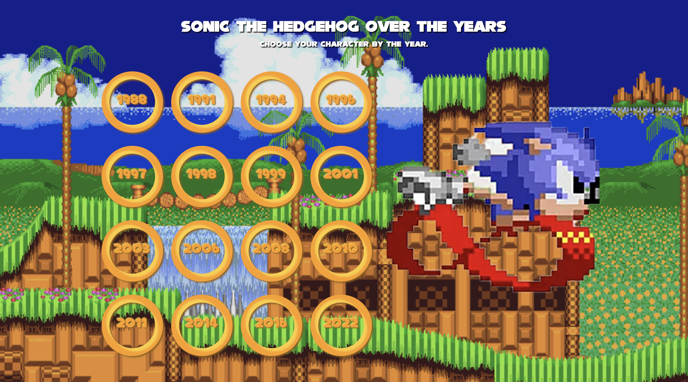
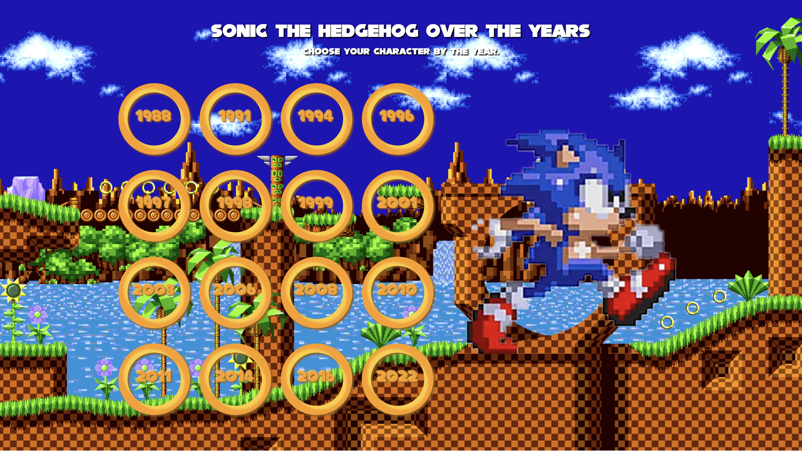

# Procesverslag
Markdown is een simpele manier om HTML te schrijven.
Markdown cheat cheet: [Hulp bij het schrijven van Markdown](https://github.com/adam-p/markdown-here/wiki/Markdown-Cheatsheet).

Nb. De standaardstructuur en de spartaanse opmaak van de README.md zijn helemaal prima. Het gaat om de inhoud van je procesverslag. Besteedt de tijd voor pracht en praal aan je website.

Nb. Door *open* toe te voegen aan een *details* element kun je deze standaard open zetten. Fijn om dat steeds voor de relevante stuk(ken) te doen.

## Jij

### Ontwerper:
Dionne Gomes

#### Je startniveau:
Mijn startniveau is: Blauw

# Je plan

  
De eerste versie/schets van je ontwerp & je persoonlijke uitdaging

  ### De eerste versie/schets:
  
  

  ### Je ambitie:
  Aan deze technieken/punten wil ik werken:
  - Ik wil graag mijn kennis van HTML, CSS en JS weer een beetje ophalen en verbeteren. In min voorafgaande jaren heb ik heel wat dingen geleerd die ik ondertussen een beetje vergeten ben dus na het volgen van dit vak hoop ik de basics weer te weten en meer.
  - Ik wil me verbeteren in de styling van CSS aangezien ik dat het leukste onderdeel vind om te doen, ik hou ervan om wat moois op te leveren en dat zou tof zijn als ik dat ook wat beter met code kan.
  - Ik wil meer leren van het coderen van animaties. Ik heb hiervoor verschillende vakken gevolgd die dingen deden met animaties als motion design en heb gemerkt dat ik hier een passie voor heb. Dus om nog meer te leren van animaties en die dan omzetten in code zou ik heel tof vinden.

## Voortgang/Feedback 1

  
Mijn bevindingen + wijzigingen (minimaal 5)

  ### Bevinding 1:
  Het idee past heel goed bij het onderwerp. De onderdelen passen allemaal bij de stijl van Sonic. Ik vind de muntjes een creatieve manier om de jaartallen weer te geven.

  #### oplossing:
  Is niet nodig. Houden zo.

  ### Bevinding 2:
  Hoe geef je de achtergrond weer? In oude pixel-vorm of realistische moderne vorm?

  #### oplossing:
  Ik ben van plan de achtergronden zo weer te geven dat ze bij dat jaartal en het karakter passen. Je krijgt dan bij de nieuwste versies van Sonic een realistische/3d achtergrond en bij de pixelige karakters een pixelige achtergrond.

  ### Bevinding 3:
  Animatie verwerken in de muntjes door middel van hover? Of in rollende Sonic?

  #### oplossing:
  Het lijkt me tof om de muntjes een horizontaal draaiende animatie mee te geven aangezien ze dat ook doen in de daadwerkelijke game en Sonic zelf springt en draait ook veel in de game dus het lijkt me leuk om dat ook in get ontwerp te verwerken.

  ### Bevinding 4:
  Ga je zelf de Sonics illustreren of maak je gebruik van afbeeldingen?

  #### oplossing:
  Ik wil proberen de muntjes zelf te gaan illustreren in HTML en CSS zodat ik ook deze vaardigheid onder de knie krijg. Verder gebruik ik bestaande afbeeldingen van de Sonic personages aangezien die per jaartal en game hun eigen vormgeving hebben gekregen en ik juist duidelijk wil laten zien.

  ### Bevinding 5:
  Misschien onder of boven Sonic de specifieke naam en het jaartal laten zien?

  #### oplossing:
  Een beetje feed forward geven is inderdaad een goed idee! Ik wil so wie so het jaartal in de ringen laten weergeven en door de animaties laten zien welke je hebt geselecteerd maar wie weet kan ik daar nog meer mee.

## Voortgang/Feedback 2

  
Mijn bevindingen + wijzigingen (minimaal 5)

  Zie hier het feedback formulier die mijn klasgenoot heeft ingevuld:
  

  ### Bevinding 1:
  Als feedback kreeg ik te horen dat de indeling van Sonic ten opzichte van de rest van de website nog niet helemaal optimaal was.

  #### oplossing:
  Dit kan ik oplossen door de afbeelding van Sonic naast de munten te positioneren met een Display Grid.

  ### Bevinding 2:
  Op het feedback formulier is aangegeven dat mijn teksten nog niet voldoende contrast hebben ten opzichte van mijn achtergrond.

  #### oplossing:
  Met de tool "https://contrast-ratio.com/" heb ik kunnen checken of mijn contrasten goed genoeg waren en als hieruit bleek dat de contrast ratio niet voldoende was heb ik de achtergrond afbeelding aangepast.

  ### Bevinding 3:
  Op het feedback formulier is aangegeven dat mijn fonts nog niet correct getoond worden als de pagina in Github wordt getoond.

  #### oplossing:
  Deze oplossing wordt ons uitgelecht in de les van dinsdag 26 april. Ook is deze les op dlo te vinden en hieruit blijkt dat er drie verschillende manieren zijn om het op te lossen. Ik heb voor de @font-face manier gekozen.

  ### Bevinding 4:
  Op het feedback formulier is aangegeven dat de states van de interactieve elementen niet passen bij het ontwerp.

  #### oplossing:
  De states apart een opmaak geven, bijvoorbeeld een actieve state in een ring in plaats van het default vierkantje.

  ### Bevinding 5:
  Op het feedback formulier is aangegeven dat er in de CSS geen commentaar is opgenomen om de structuur duidelijk te maken en om uitleg te geven.

  #### oplossing:
  Dit kan ik gemakkelijk oplossen door aan te geven wat de functie is van de stukken code die ik geschreven heb met /*...*/ .

## Voortgang/Feedback 3

  
Mijn bevindingen + wijzigingen (minimaal 5)

  Zie hier het feedback formulier die mijn klasgenoot heeft ingevuld:
  

  ### Bevinding 1:
  Op het feedback formulier wordt aangegeven dat de jaartallen een stukje uit steken onder het scherm waar de achtergrond afbeelding stopt.

  #### oplossing:
  Dit heb ik opgelost door de "background-size" op "cover" te zetten en de "ol" (het gedeelte onder de ringen dus) een "padding" aan de onderkant te geven.

  ### Bevinding 2:
  Op het feedback formulier wordt aangegeven dat ik nog steeds geen commentaar verwerkt heb na de vorige feedback.

  #### oplossing:
  Dit keer wel echt commentaar toevoegen in de css met /*...*/ .

  ### Bevinding 3:
  Op het feedback formulier wordt aangegeven dat ik geen bronnen heb opgenomen.

  #### oplossing:
  Veel bronnen heb ik niet gebruikt, af en toe alleen even gespiekt op "https://www.w3schools.com/" om te kijken hoe het ook alweer zat. Deze website zal ik in mijn code toevoegen.

  ### Bevinding 4:
  Op het feedback formulier wordt aangegeven dat de CSS properties niet binnen een selector staan in dezelfde volgorde.

  #### oplossing:
  Dit kan ik gemakkelijk oplossen door de structuur van mijn code wat netter te maken en wat meer te groeperen. Dus toepassen wat we in de les van donderdag behandeld hebben.

  ### Bevinding 5:
  Op het feedback formulier wordt aangegeven dat er geen CSS custom properties worden gebruikt voor alle kleurtjes en verloopjes.

  #### oplossing:
  Dit heb ik direcht toegevoegd doormiddel van:
  :root {
    --color-text: white;
    --color-ring-base: #FA9F1A;
    --color-ring-shadow: #945F0C;
    --color-ring-light: #FBCD38;
}

## Reflectie

  
Mijn eindresultaat & persoonlijke ontwikkeling

  ### Je uitkomst - karakteristiek screenshot(s):
  Home page:
  

  Detail pages:
  
  
  
  
  
  
  
  
  
  
  
  
  
  
  
  

  ### Dit ging goed/Heb ik geleerd:
  Ik vond het erg leuk om weer de HTML, CSS en JS in te duiken en op te halen wat ik hiervan nog wist. Mijn vaardigheden heb ik ook zeker wel verbeterd. Ik begrijp nu veel meer van het animeren in CSS en dat je daar nog veel meer hele leuk dingen mee kan. Specifiek in de les waarbij we gingen animeren viel het me alles mee hoe ingewikkeld het was en hoe lastig ik het vond.  Zie <a href="https://codepen.io/DionneGomes/pen/yLpGmzg?editors=1100">Codepen Animaties</a>. Ik snap nu ook meer van positionering met Display Grid en het goed toepassen van lettertypes in mijn website. Dat vond ik erg nuttig.

  ### Dit was lastig/Is niet gelukt:
  Het werken met Js blijf ik altijd even moeilijker vinden als ik hoop. Op de een of andere manier geeft de pagina de achtergronden goed weer als je ze wilt bekijken van laag naar hoog jaartal en verkeerd als je ze in een andere volgorde aanklikt. Hierdoor worden niet altijd de juiste achtergronden getoond bij het juiste karakter van Sonic.

  Ook wilde ik graag een tweede animatie toevoegen aan de Ring als je erop geklikt had. Ik heb hiervoor van alles geprobeerd in JS en CSS met weinig succes helaas. Ik had het zo leuk gevonden als je bij een active state van de ring de ring zou kunnen laten opspringen en wegvagen zoals het ook gebeurt in de daadwerkelijke game.

## Bronnenlijst

continu bijhouden terwijl je werkt

1. https://www.w3schools.com/html/default.asp : Voor het opzoeken en na gaan hoe ik een bepaald html onderdeel ook al weer neer moest zetten.
2. https://www.w3schools.com/css/default.asp : Voor het opzoeken en na gaan hoe ik een bepaald css onderdeel ook al weer neer moest zetten.
3. https://codepen.io/shooft/pen/VwyqEMv?editors=1100 : Afkijken animatie
4. https://codepen.io/shooft/pen/XWVeoEx : Akijken states
5. https://css-tricks.com/snippets/css/a-guide-to-flexbox/ : Flexbox
6. https://www.fontsquirrel.com/tools/webfont-generator: Font Squirrel - font generator
7. https://contrast-ratio.com/ Contrast-ratio-checker Lea Verou

