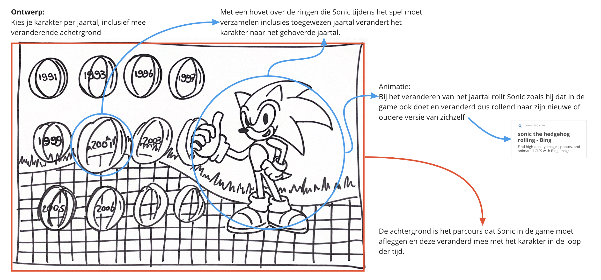
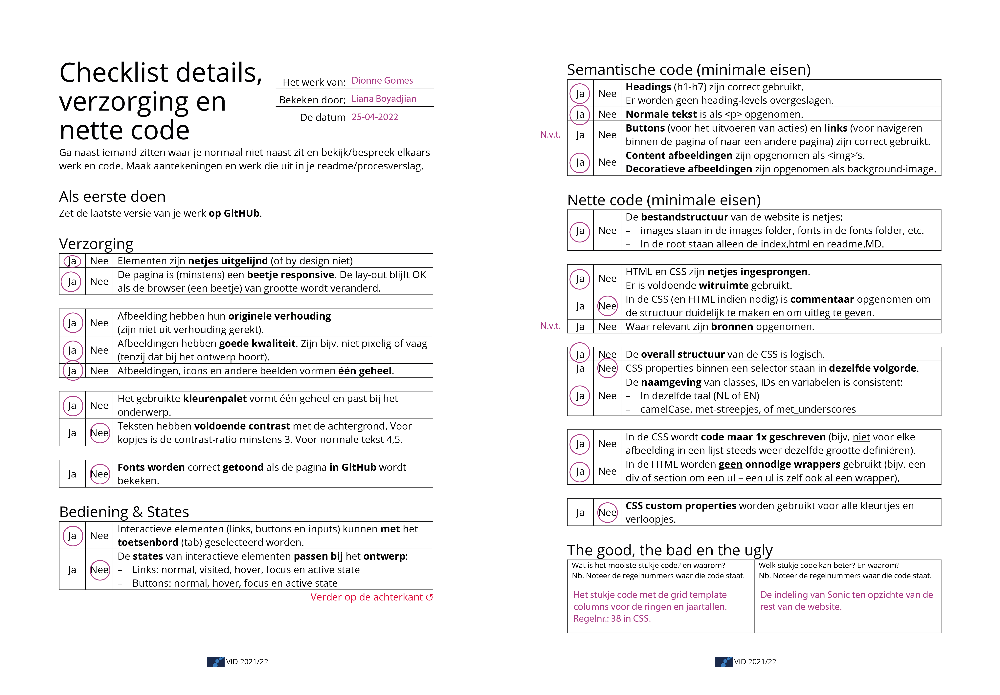

# Procesverslag
Markdown is een simpele manier om HTML te schrijven.
Markdown cheat cheet: [Hulp bij het schrijven van Markdown](https://github.com/adam-p/markdown-here/wiki/Markdown-Cheatsheet).

Nb. De standaardstructuur en de spartaanse opmaak van de README.md zijn helemaal prima. Het gaat om de inhoud van je procesverslag. Besteedt de tijd voor pracht en praal aan je website.

Nb. Door *open* toe te voegen aan een *details* element kun je deze standaard open zetten. Fijn om dat steeds voor de relevante stuk(ken) te doen.

## Jij

### Ontwerper:
Dionne Gomes

#### Je startniveau:
Mijn startniveau is: Blauw

# Je plan

  
De eerste versie/schets van je ontwerp & je persoonlijke uitdaging

  ### De eerste versie/schets:
  
  

  ### Je ambitie:
  Aan deze technieken/punten wil ik werken:
  - Ik wil graag mijn kennis van HTML, CSS en JS weer een beetje ophalen en verbeteren. In min voorafgaande jaren heb ik heel wat dingen geleerd die ik ondertussen een beetje vergeten ben dus na het volgen van dit vak hoop ik de basics weer te weten en meer.
  - Ik wil me verbeteren in de stijling van CSS aangezien ik dat het leukste onderdeel vind om te doen, ik hou er van om wat moois op te leveren en dat zou tof zijn als ik dat ook wat beter met code kan.
  - Ik wil meer leren van het coderen van animaties. Ik heb hiervoor verschillende vakken gevolgd die dingen deden met aniaties als motion design en heb gemerkt dat ik hier een passie voor heb. Dus om nog meer te leren van animaties en die dan omzetten in code zou ik heel tof vinden.

## Voortgang/Feedback 1

  
Mijn bevindingen + wijzigingen (minimaal 5)

  ### Bevinding 1:
  Het idee past heel goed bij het onderwerp. De onderdelen passen allemaal bij de stijl van Sonic. Ik vind de muntjes een creatieve manier om de jaartallen weer te geven.

  #### oplossing:
  Is niet nodig. Houden zo.

  ### Bevinding 2:
  Hoe geef je de achtergrond weer? In oude pixel-vorm of realistische moderne vorm?

  #### oplossing:
  Ik ben van plan de achtergrinden zo weer te geven dat ze bij dat jaartal en het karakter passen. Je krijgt dan bij de nieuwste versies van sonic een realistische/3d achtergrond en bij de pixelige karakters een pixelige achtergrond.

  ### Bevinding 3:
  Animatie verwerken in de muntjes door middel van hover? Of in rollende Sonic?

  #### oplossing:
  Het lijkt me tof om de muntjes een horizontaal draaiende animatie mee te geven aangezien ze dat ook doen in de daadwerkelijke game en sonic zelf springt en draait ook veel in de game dus het lijkt me leuk om dat ook in get ontwerp te verwerken.

  ### Bevinding 4:
  Ga je zelf de sonics illustreren of maak je gebruik van afbeeldingen?

  #### oplossing:
  Ik wil proberen de muntjes zelf te gaan illustreren in HTML en CSS zodat ik ook deze vaardigheid onder de knie krijg. Verder gebruik ik bestaande afbeeldingen van de Sonic personages aangezien die per jaartal en game hun eigen vormgeving hebben gekregen en ik juist duidelijk wil laten zien.

  ### Bevinding 5:
  Misschien onder of boven Sonic de specifieke naam en het jaartal laten zien?

  #### oplossing:
  Een beetje feedformward geven is inderdaad een goed idee! Ik wil so wie so het jaartal in de ringen laten weergeven en door de animaties laten zien welke je hebt geselecteerd maar wie weet kan ik daar nog meer mee.

## Voortgang/Feedback 2

  
Mijn bevindingen + wijzigingen (minimaal 5)

  Zie hier het feedback formulier die mijn klasgenoot heeft ingevuld:
  

  ### Bevinding 1:
  Omschrijving van wat er nog niet orde was (tekst en afbeeding(en)).

  #### oplossing:
  Beschrijving hoe je het hebt hebt opgelost of als het niet gelukt is hoe je het zou oplossen (tekst en afbeeding(en)).

  ### Bevinding 2:
  Omschrijving van wat er nog niet orde was (tekst en afbeeding(en)).

  #### oplossing:
  Beschrijving hoe je het hebt hebt opgelost of als het niet gelukt is hoe je het zou oplossen (tekst en afbeeding(en)).

  ### Bevinding 3:
  ...

## Voortgang/Feedback 3

  
Mijn bevindingen + wijzigingen (minimaal 5)

  ### Bevinding 1:
  Omschrijving van wat er nog niet orde was (tekst en afbeeding(en)).

  #### oplossing:
  Beschrijving hoe je het hebt hebt opgelost of als het niet gelukt is hoe je het zou oplossen (tekst en afbeeding(en)).

  ### Bevinding 2:
  Omschrijving van wat er nog niet orde was (tekst en afbeeding(en)).

  #### oplossing:
  Beschrijving hoe je het hebt hebt opgelost of als het niet gelukt is hoe je het zou oplossen (tekst en afbeeding(en)).

  ### Bevinding 3:
  ...

## Reflectie

  
Mijn eindresultaat & persoonlijke ontwikkeling

  ### Je uitkomst - karakteristiek screenshot(s):
  

  ### Dit ging goed/Heb ik geleerd:
  Korte omschrijving met plaatje(s)

  

  ### Dit was lastig/Is niet gelukt:
  Korte omschrijving met plaatje(s)

  

## Bronnenlijst

continu bijhouden terwijl je werkt

Nb. Wees specifiek ('css-tricks' als bron is bijv. niet specifiek genoeg).

1. bron 1
2. bron 2
3. ...

